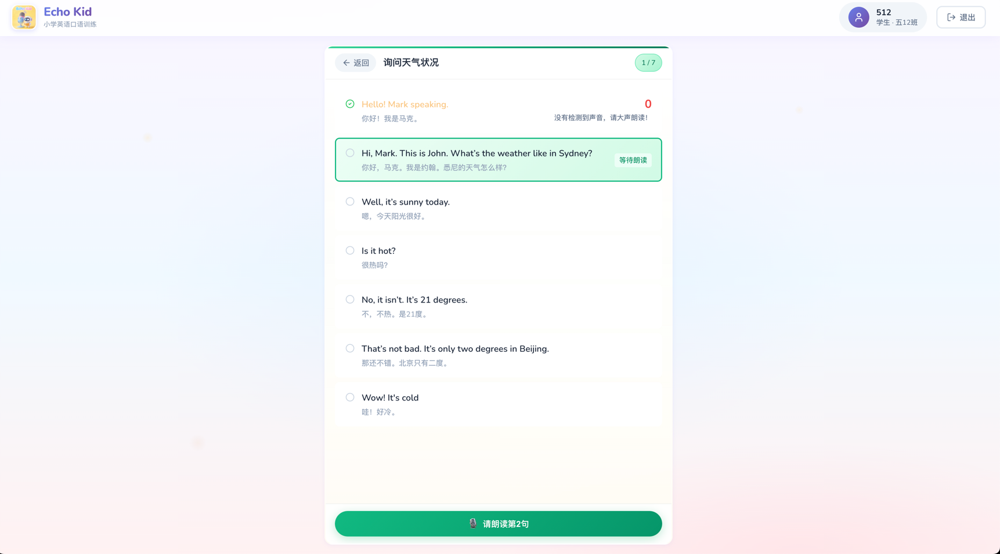
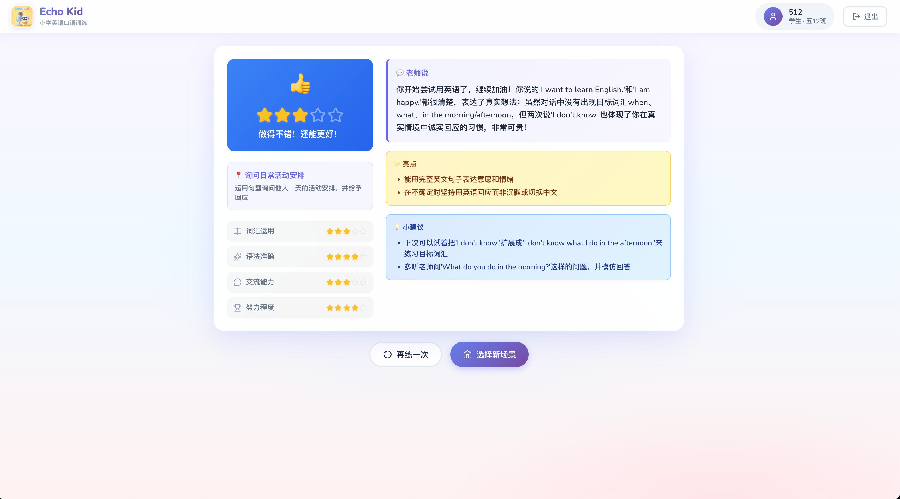
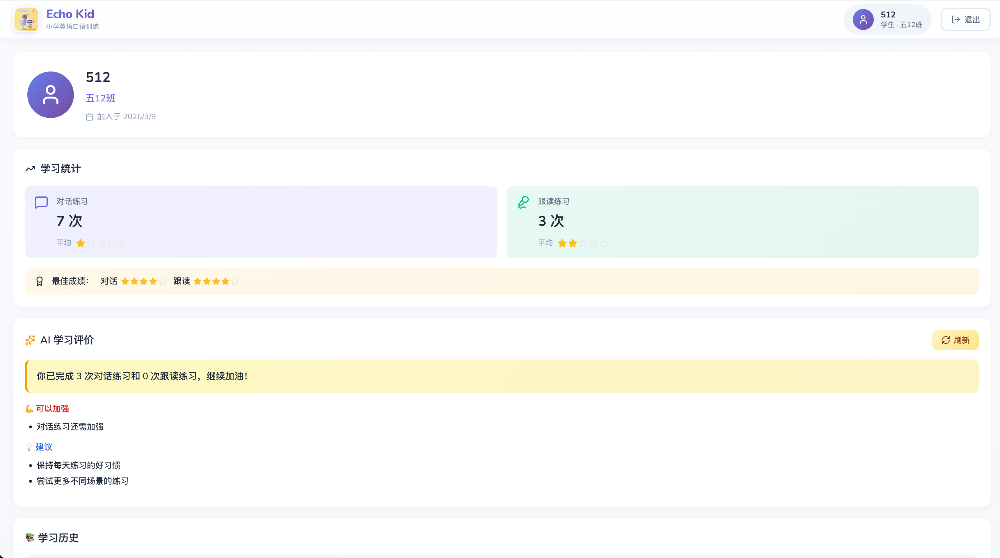

# Word Teacher - AI English Speaking Practice System

English | [中文](README.md)

An AI-powered English speaking practice application. Through **scenario-based AI conversations + read-aloud practice + word games + real-time speech recognition + intelligent scoring feedback**, it helps students practice speaking English frequently in a relaxed environment.

## 📸 Screenshots







---

## 🎯 Product Positioning

- **Target Users**: English learners (students and adults)
- **Core Scenarios**: After-class speaking practice, self-study during holidays
- **Teaching Philosophy**: Immersive dialogue + instant feedback + encouraging evaluation

## ✨ Core Features

### 📱 Student Features

#### 🎙️ Read-Aloud Practice
- **Sentence Reading**: Follow and read standard English sentences
- **AI Voice Scoring**: Real-time pronunciation analysis with multi-dimensional scoring
- **Scoring Dimensions** (1-5 stars):
  - 🎵 Pronunciation & Intonation
  - 🌊 Fluency & Coherence
  - ✓ Accuracy & Completeness
  - ❤️ Emotional Expression
- **Instant Feedback**: Score and pronunciation comparison for each sentence
- **Progress Tracking**: Record each practice score and view improvement trajectory

#### 🎯 AI Conversation Practice
- **Life Scenarios**: Greetings, self-introduction, shopping, restaurant ordering, numbers & colors
- **AI Conversation Partner**: Friendly AI character (Lily) engages in natural dialogue, 5 rounds per practice
- **Voice + Text Input**: Support for voice recording or keyboard input
- **Real-time Translation**: AI responses automatically display Chinese translation
- **Voice Playback**: AI responses are automatically read aloud

#### ⭐ Intelligent Scoring System
- **Multi-dimensional Scoring**:
  - 📖 Grammar Accuracy
  - 🗣️ Fluency
  - 💡 Content Relevance
  - 🎯 Effort Level
- **Encouraging Feedback**: Motivational comments and improvement suggestions after each practice
- **1-5 Star Rating**: Intuitive performance display

### 👩‍🏫 Teacher Admin Panel

- **Dashboard**: Statistics cards + quick action shortcuts
- **Teacher Management** (Admin only): Add/edit/delete teacher accounts
- **Class Management**: Create classes, assign teachers
- **Student Management**: Student list, batch import via Excel, view records
- **Read-Aloud Records**: View all student practice records with filtering
- **Scene Management**: Create read-aloud and conversation scenarios
- **Word Pack Management**: Create/edit word packs for games, categorized by game type
- **Game Records**: View student game completion records and scores
- **Progress Tracking**: Class trends, individual progress, leaderboards, AI reports

### 🎮 Word Games

Four fun mini-games to help students memorize vocabulary:

- **🎯 Word Shooter**: Shoot flying word bubbles, train reaction speed and vocabulary recognition
- **🍳 Food Truck (Spell)**: NPC customers order food, students spell words to "serve" dishes
- **⛏️ Gold Miner**: Control a miner to dig word gems in an underground adventure
- **🃏 Magic Match**: 4×3 memory matching game, match English words with Chinese meanings

**Game Features**:
- Unique background music for each game (procedurally generated via Web Audio API)
- Combo scoring and wrong-word tracking
- Auto-save results + DingTalk notifications to teachers
- Teachers can manage word packs and view game records from admin panel

## 🛠️ Tech Stack

```
word-teacher/
├── frontend/          # Student frontend (Vite + React + TypeScript + SCSS)
│   └── src/games/     # Word game modules (shooter/spell/miner/match)
├── admin/             # Admin panel (Vite + React + TypeScript + SCSS)
├── backend/           # Node.js backend (Express + Prisma + MySQL)
├── agent/             # AI Agent service (Qwen + DashScope API)
└── pnpm-workspace.yaml
```

### Frontend
- **React 19** + TypeScript
- **Vite** build tool
- **React Router** for routing
- **SCSS** styling
- **Web Audio API** for recording + procedural game music/SFX generation
- **Canvas 2D** game rendering (Shooter, Miner)
- **SSE** for streaming responses

### Backend
- **Node.js** + Express 5
- **Prisma ORM** + MySQL
- **JWT** authentication
- **RESTful API** + SSE streaming

### AI Services
- **Qwen-Omni** multimodal dialogue (voice input + output)
- **Qwen-Plus** translation and text generation
- **Paraformer** speech recognition (ASR)
- **CosyVoice** text-to-speech (TTS)

## 🚀 Quick Start

### 1. Install dependencies

```bash
pnpm install
```

### 2. Start MySQL

```bash
# Using Docker
docker compose up -d mysql

# Or using Homebrew
brew services start mysql
```

### 3. Initialize database

```bash
cd backend
pnpm db:push    # Sync database schema
pnpm db:seed    # Seed test data
```

### 4. Configure environment variables

```bash
cp backend/.env.example backend/.env
cp agent/.env.example agent/.env
# Edit agent/.env and set your DASHSCOPE_API_KEY
```

### 5. Start development servers

```bash
pnpm dev

# Or start separately
cd frontend && pnpm dev   # Student app http://localhost:5173
cd admin && pnpm dev      # Admin panel http://localhost:5174
cd backend && pnpm dev    # Backend http://localhost:3001
cd agent && pnpm dev      # Agent http://localhost:8000
```

### Test Accounts

| Role | Username | Password |
|------|----------|----------|
| Admin | `admin` | `123456` |
| Teacher | `xiaomei` | `123456` |
| Student | `2026050101` | `123456` |

## 🚀 Production Deployment

### GitHub Actions CI/CD

This project supports **push-to-deploy** via GitHub Actions:

1. Fork this repository
2. Configure the following Secrets in **Settings → Secrets and variables → Actions**:

| Secret | Description |
|--------|-------------|
| `SERVER_HOST` | Server IP |
| `SERVER_SSH_KEY` | SSH private key |
| `DOCKER_PASSWORD` | Docker Hub Token |
| `MYSQL_ROOT_PASSWORD` | MySQL root password |
| `MYSQL_PASSWORD` | MySQL app password |
| `JWT_SECRET` | JWT signing key |
| `AGENT_API_KEY` | Agent API key |
| `DASHSCOPE_API_KEY` | Alibaba Cloud AI API Key |

3. Add `DOCKER_USERNAME` in **Variables** (your Docker Hub username)
4. Push to `master` branch to auto-deploy 🚀

👉 **Full deployment guide**: [deploy/DEPLOYMENT.md](deploy/DEPLOYMENT.md)

## 📖 Documentation

- [Quick Start](QUICK_START.md) - Get running in 5 minutes
- [Testing Guide](docs/TESTING_GUIDE.md) - Feature testing checklist
- [Development Guide](docs/DEVELOPMENT_GUIDE.md) - Local development workflow
- [Deployment Guide](deploy/DEPLOYMENT.md) - Production deployment instructions

## 📝 License

MIT

